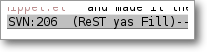
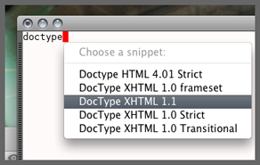
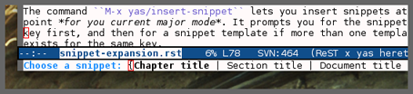
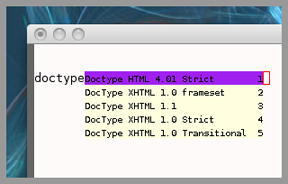

==================
Expanding snippets
==================

.. _Organizing Snippets: snippet-organization.html
.. _Expanding Snippets: snippet-expansion.html
.. _Writing Snippets: snippet-development.html
.. _The YASnippet Menu: snippet-menu.html

.. contents::

Triggering expansion
====================

You can use YASnippet to expand snippets in different ways:

* By typing an abbrev, the snippet *trigger key*, and then pressing
  the key defined in ``yas/trigger-key`` (which defaults to
  "TAB"). This works in buffers where the minor mode
  ``yas/minor-mode`` is active;

* By invoking the command ``yas/insert-snippet`` (either by typing
  ``M-x yas/insert-snippet`` or its keybinding). This does *not*
  require ``yas/minor-mode`` to be active.

* By using the keybinding associated with an active snippet. This also
  requires ``yas/minor-mode`` to be active;

* By expanding directly from the "YASnippet" menu in the menu-bar

* By using hippie-expand

* Expanding from emacs-lisp code

Trigger key
-----------

When ``yas/minor-mode`` is enabled, the keybinding taken from
``yas/trigger-key`` will take effect.

``yas/trigger-key`` invokes ``yas/expand``, which tries to expand a
*snippet abbrev* (also known as *snippet key*) before point. 

The default key is ``"TAB"``, however, you can freely set it to some
other key.

To enable the YASnippet minor mode in all buffers globally use the
command ``yas/global-mode``. 

When you use ``yas/global-mode`` you can also selectively disable
YASnippet in some buffers by setting the buffer-local variable
``yas/dont-active`` in the buffer's mode hook.

Trouble when using or understanding the ``yas/trigger-key`` is easily
the most controversial issue in YASsnippet. See the `FAQ <faq.html>`_.

Fallback bahaviour
~~~~~~~~~~~~~~~~~~

``yas/fallback-behaviour`` is a customization variable bound to
``'call-other-command`` by default. If ``yas/expand`` failed to find
any suitable snippet to expand, it will disable the minor mode
temporarily and find if there's any other command bound the
``yas/trigger-key``. 

If found, the command will be called. Usually this works very well --
when there's a snippet, expand it, otherwise, call whatever command
originally bind to the trigger key.

However, you can change this behavior by customizing the
``yas/fallback-behavior`` variable. If you set this variable to
``'return-nil``, it will return ``nil`` instead of trying to call the
*original* command when no snippet is found.

Insert at point
---------------

The command ``M-x yas/insert-snippet`` lets you insert snippets at
point *for you current major mode*. It prompts you for the snippet
key first, and then for a snippet template if more than one template
exists for the same key.

The list presented contains the snippets that can be inserted at
point, according to the condition system. If you want to see all
applicable snippets for the major mode, prefix this command with
``C-u``.

The prompting methods used are again controlled by
``yas/prompt-functions``.

Snippet keybinding
------------------

See the section of the ``# binding:`` directive in `Writing
Snippets`_.

Expanding from the menu
-----------------------

See `the YASnippet Menu`_.

Expanding with ``hippie-expand``
----------------------------------

To integrate with ``hippie-expand``, just put
``yas/hippie-try-expand`` in
``hippie-expand-try-functions-list``. This probably makes more sense
when placed at the top of the list, but it can be put anywhere you
prefer.

Expanding from emacs-lisp code
------------------------------

Sometimes you might want to expand a snippet directly from you own
elisp code. You should call ``yas/expand-snippet`` instead of
``yas/expand`` in this case.

As with expanding from the menubar, the condition system and multiple
candidates doesn't affect expansion. In fact, expanding from the
YASnippet menu has the same effect of evaluating the follow code:

.. sourcecode:: common-lisp

  (yas/expand-snippet template)

See the internal documentation on ``yas/expand-snippet`` for more
information.

Controlling expansion
=====================

Eligible snippets
-----------------

YASnippet does quite a bit of filtering to find out which snippets are
eligible for expanding at the current cursor position.

In particular, the following things matter:

* Currently loaded snippets tables

  These are loaded from a directory hierarchy in your file system. See
  `Organizing Snippets`_. They are named after major modes like
  ``html-mode``, ``ruby-mode``, etc...

* Major mode of the current buffer

  If the currrent major mode matches one of the loaded snippet tables,
  then all that table's snippets are considered for expansion. Use
  ``M-x describe-variable RET major-mode RET`` to find out which major
  mode you are in currently.

* Parent tables

  Snippet tables defined as the parent of some other eligible table
  are also considered. This works recursively, i.e. parents of parents
  of eligible tables are also considered.

* Buffer-local ``yas/mode-symbol`` variable

  This can be used to consider snippet tables whose name does not
  correspond to a major mode. If you set this variable to a name ,
  like ``rinari-minor-mode``, you can have some snippets expand only
  in that minor mode. Naturally, you want to set this conditionally,
  i.e. only when entering that minor mode, so using a hook is a good
  idea.

.. sourcecode:: common-lisp

  ;; When entering rinari-minor-mode, consider also the snippets in the
  ;; snippet table "rails-mode"
  (add-hook 'rinari-minor-mode-hook
            #'(lambda ()
                (setq yas/mode-symbol 'rails-mode)))

* Buffer-local ``yas/buffer-local-condition`` variable

  This variable provides finer grained control over what snippets can
  be expanded in the current buffer. The default value won't let you
  expand snippets inside comments or string literals for example. See
  `The condition system`_ for more info.

The condition system
--------------------

Consider this scenario: you are an old Emacs hacker. You like the
abbrev-way and set ``yas/trigger-key`` to ``"SPC"``. However,
you don't want ``if`` to be expanded as a snippet when you are typing
in a comment block or a string (e.g. in ``python-mode``).

If you use the ``# condition :`` directive (see `Writing Snippets`_)
you could just specify the condition for ``if`` to be ``(not
(python-in-string/comment))``. But how about ``while``, ``for``,
etc. ? Writing the same condition for all the snippets is just
boring. So has a buffer local variable
``yas/buffer-local-condition``. You can set this variable to ``(not
(python-in-string/comment))`` in ``python-mode-hook``.

Then, what if you really want some particular snippet to expand even
inside a comment? This is also possible! But let's stop telling the
story and look at the rules:

* If ``yas/buffer-local-condition`` evaluate to nil, no snippets will
  be considered for expansion.
  
* If it evaluates to the a *cons cell* where the ``car`` is the symbol
  ``require-snippet-condition`` and the ``cdr`` is a symbol (let's
  call it ``requirement``), then:

  * Snippets having no ``# condition:`` directive won't be considered;
  
  * Snippets with conditions that evaluate to nil (or produce an
    error) won't be considered;

  * If the snippet has a condition that evaluates to non-nil (let's
    call it ``result``):

    * If ``requirement`` is ``t``, the snippet is ready to be
      expanded;
      
    * If ``requirement`` is ``eq`` to ``result``, the snippet is ready
      to be expanded;
      
    * Otherwise the snippet won't be considered.

* If it evaluates to the symbol ``always``, all snippets are
  considered for expansion, regardless of any conditions.

* If it evaluate to ``t`` or some other non-nil value:

  * If the snippet has no condition, or has a condition that evaluate
    to non-nil, it is ready to be expanded.
    
  * Otherwise, it won't be considered.

In the mentioned scenario, set ``yas/buffer-local-condition`` like
this

.. sourcecode:: common-lisp

  (add-hook 'python-mode-hook
            '(lambda ()
               (setq yas/buffer-local-condition
                     '(if (python-in-string/comment)
                          '(require-snippet-condition . force-in-comment)
                        t))))

... and specify the condition for a snippet that you're going to
expand in comment to be evaluated to the symbol
``force-in-comment``. Then it can be expanded as you expected, while
other snippets like ``if`` still can't expanded in comment.

Multiples snippet with the same key
-----------------------------------

The rules outlined `above <Eligible snippets>`_ can return more than
one snippet to be expanded at point.

When there are multiple candidates, YASnippet will let you select
one. The UI for selecting multiple candidate can be customized through
``yas/prompt-functions`` , which defines your preferred methods of
being prompted for snippets.

You can customize it with ``M-x customize-variable RET
yas/prompt-functions RET``. Alternatively you can put in your
emacs-file:

.. sourcecode:: common-lisp
   
   (setq yas/prompt-functions '(yas/x-prompt yas/dropdown-prompt))

Currently there are some alternatives solution with YASnippet.

Use the X window system
~~~~~~~~~~~~~~~~~~~~~~~

The function ``yas/x-prompt`` can be used to show a popup menu for you
to select. This menu will be part of you native window system widget,
which means:

* It usually looks beautiful. E.g. when you compile Emacs with gtk
  support, this menu will be rendered with your gtk theme.
* Your window system may or may not allow to you use ``C-n``, ``C-p``
  to navigate this menu. 
* This function can't be used when in a terminal.

Minibuffer prompting
~~~~~~~~~~~~~~~~~~~~

You can use functions ``yas/completing-prompt`` for the classic emacs
completion method or ``yas/ido-prompt`` for a much nicer looking
method. The best way is to try it. This works in a terminal.

Use ``dropdown-menu.el``
~~~~~~~~~~~~~~~~~~~~~~~~

The function ``yas/dropdown-prompt`` can also be placed in the
``yas/prompt-functions`` list.

This works in both window system and terminal and is customizable, you
can use ``C-n``, ``C-p`` to navigate, ``q`` to quit and even press
``6`` as a shortcut to select the 6th candidate.

Roll your own
~~~~~~~~~~~~~

See below for the documentation on variable ``yas/prompt-functions``

Customizable Variables
======================

``yas/prompt-functions``
------------------------

You can write a function and add it to the ``yas/prompt-functions``
list. These functions are called with the following arguments:

* PROMPT: A string to prompt the user;

* CHOICES: A list of strings or objects;

* optional DISPLAY-FN : A function. When applied to each of the
  objects in CHOICES it will return a string;

The return value of any function you put here should be one of
the objects in CHOICES, properly formatted with DISPLAY-FN (if
that is passed).

* To signal that your particular style of prompting is unavailable at
  the moment, you can also have the function return nil.

* To signal that the user quit the prompting process, you can signal
  ``quit`` with ``(signal 'quit "user quit!")``

``yas/fallback-behavior``
-------------------------

How to act when ``yas/expand`` does *not* expand a snippet.

``call-other-command`` means try to temporarily disable YASnippet and
    call the next command bound to ``yas/trigger-key``.

``return-nil`` means return nil. (i.e. do nothing)

An entry (apply COMMAND . ARGS) means interactively call COMMAND, if
ARGS is non-nil, call COMMAND non-interactively with ARGS as
arguments.

``yas/choose-keys-first``
-------------------------

If non-nil, prompt for snippet key first, then for template.

Otherwise prompts for all possible snippet names.

This affects ``yas/insert-snippet`` and ``yas/visit-snippet-file``.

``yas/choose-tables-first``
---------------------------  

If non-nil, and multiple eligible snippet tables, prompts user for
tables first.

Otherwise, user chooses between the merging together of all
eligible tables.

This affects ``yas/insert-snippet``, ``yas/visit-snippet-file``

``yas/key-syntaxes``
--------------------

The default searching strategy is quite powerful. For example, in
``c-mode``, ``bar``, ``foo_bar``, ``"#foo_bar"`` can all be recognized
as a snippet key. Furthermore, the searching is in that order. In
other words, if ``bar`` is found to be a key to some *valid* snippet,
then that snippet is expanded and replaces the ``bar``. Snippets
pointed to by ``foo_bar`` and ``"#foobar`` won't be considered.

However, this strategy can also be customized easily from the
``yas/key-syntaxes`` variable. It is a list of syntax rules, the
default value is ``("w" "w_" "w_." "^ ")``. Which means search the
following thing until found one:

* a word.
* a symbol. In lisp, ``-`` and ``?`` can all be part of a symbol.
* a sequence of characters of either word, symbol or punctuation.
* a sequence of characters of non-whitespace characters.

But you'd better keep the default value unless you want to understand
how Emacs's syntax rules work...

