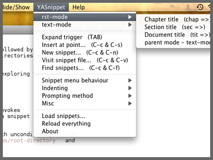

==============
YASnippet menu
==============

.. contents::

When ``yas/minor-mode`` is active, YASnippet will setup a menu just
after the "Buffers" menu in the menubar. 

In this menu, you can find

* The currently loaded snippet definitions, organized by major mode,
  and optional grouping.

* A rundown of the most common commands, (followed by their
  keybindings) including commands to load directories and reload all
  snippet definitions.

* A series of submenus for customizing and exploring YASnippet
  behavior.

Loading snippets from menu
--------------------------

Invoking "Load snippets..." from the menu invokes
``yas/load-directory`` and prompts you for a snippet directory
hierarchy to load.

Also useful is the "Reload all" options which uncondionally reloads
all the snippets directories defined in ``yas/root-directory`` and
rebuilds the menus.

Snippet menu behavior
---------------------

YASnippet will list in this section all the loaded snippet definitions
organized by snippet table name.

You can use this section to explore currently loaded snippets. If you
click on one of them, the default behavior is to expand it,
unconditionally, inside the current buffer.

You can however, customize variable ``yas/visit-from-menu`` to be
``t`` which will take you to the snippet definition file when you
select it from the menu.

If you want the menu show only snippet tables whose name corresponds
to a "real" major mode. You do this by setting ``yas/use-menu`` to
``'real-modes``.

Finally, to have the menu show only the tables for the currently
active mode, set ``yas/use-menu`` to ``abbreviate``.

These customizations can also be found in the menu itself, under the
"Snippet menu behavior" submenu.

Controlling indenting
---------------------

The "Indenting" submenu contains options to control the values of
``yas/indent-line`` and ``yas/also-auto-indent-first-line``. See
`Writing snippets <snippet-development.html>`_ .

Prompting method
----------------

The "Prompting method" submenu contains options to control the value
of ``yas/prompt-functions``. See `Expanding snippets <snippet-expansion.html>`_ .

Misc
----

The "Misc" submenu contains options to control the values of more
variables.

